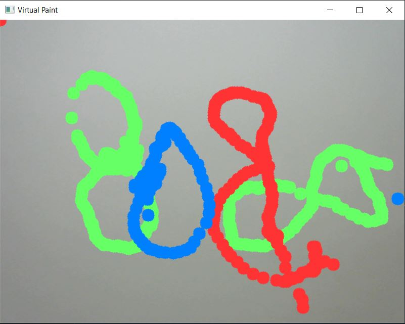

# Virtual-Paint
# Virtual-Paint
Virtual paint is developed  using OpenCV. The objective of this project is to draw virtually with the same colour as the object/marker colour in our hand. It finds the colour contours using webcam and place different points wherever it find the colour, creates a list of points and display/draw them and loop it around.

Currently, I have added Red, Green, Blue colours. If we want to add more colours then we have to find minimum and maximum Hue and Saturation using [colorPicker.py](https://github.com/Amlend/Virtual-Paint/blob/main/colorPicker.py) and adjusting the trackbars until we find our desired colour as white and other colours as black. Add the values in the list named myColors and in myColorValues list add BGR values of the colour in [virtualPaint.py](https://github.com/Amlend/Virtual-Paint/blob/main/virtualPaint.py).
